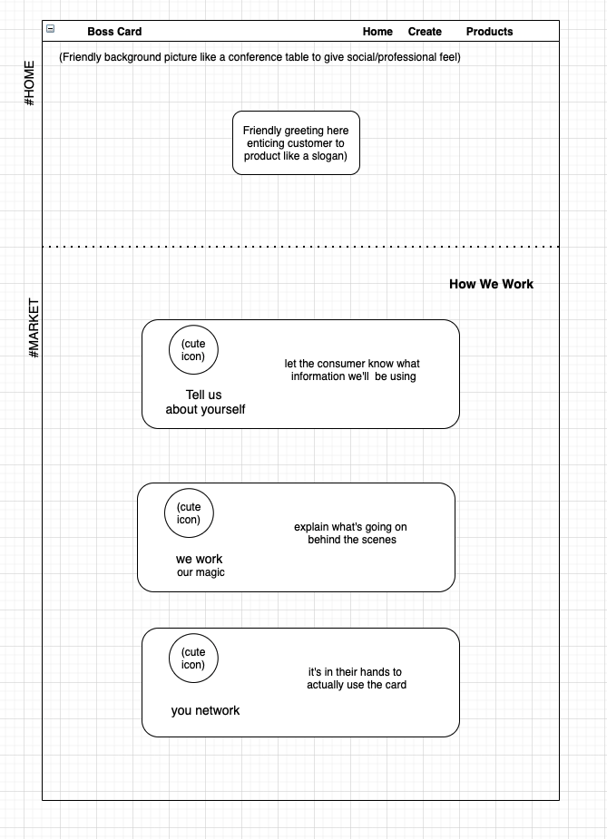
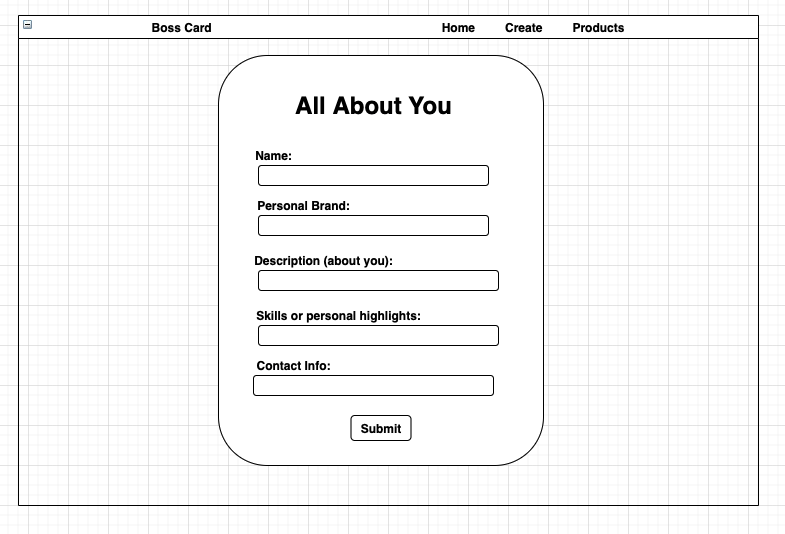
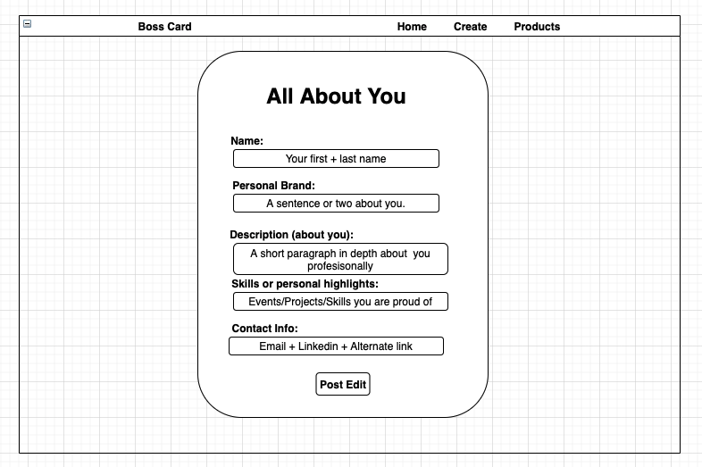
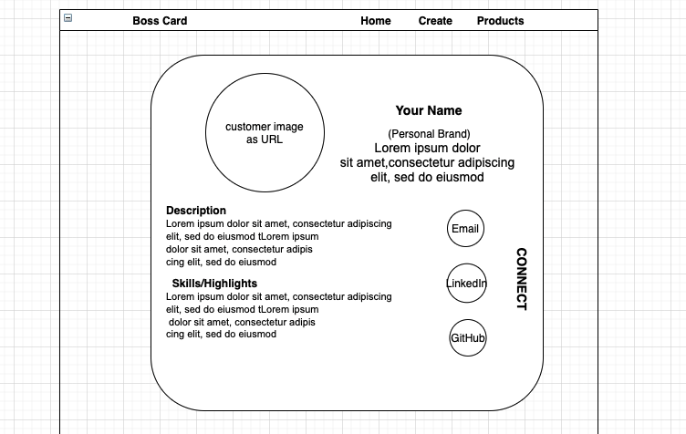
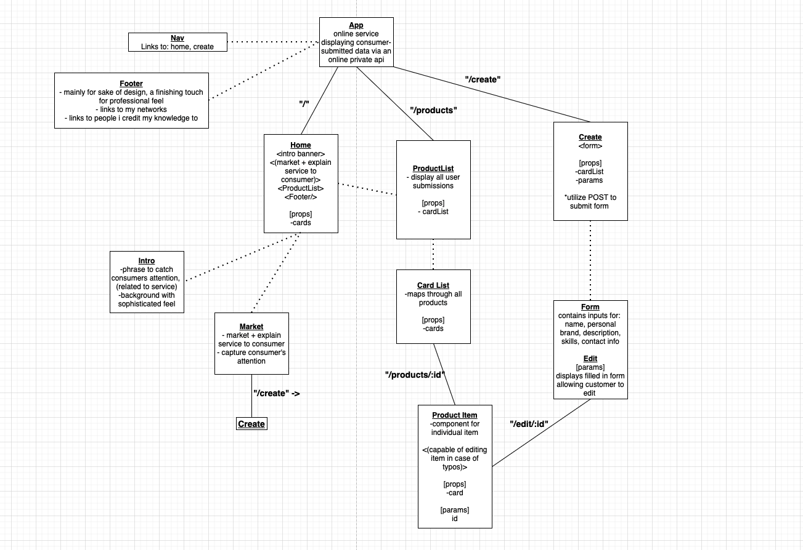

<!-- CODENAME: BANANAS -->

# iNetwork
Deployed via Netlify at: (https://inetwork.netlify.app/)

## Description

It's not every day that you run into British billionaire Sir Richard Branson, but when you do, you probably don't want to greet him with a portfolio consisting of a cover letter, resume, certifications, etc.
Sometimes you want a dash of professional swagger to entice your new connection instead!
<br>
Striving to get your name within reach, our virtual business card will equip your connections with a first impression of your design.

## Wireframes

### Home + Market



### Create



### Edit



### Product Item / List (as carousel)


<small>**responsiveness accounted for thanks to bootstrap</small>

## Component Hierarchy



## API and Data Sample

```json
{
  "id": "recOLaMaqz6dnvZX7",
  "fields": {
    "Name": "Rodrigo Rubberwings",
    "Highlights": "Social, Enthusiastic, Problem Solver, Inanimate",
    "Description": "As a rubber duck, I am only ever focused on one thing: getting you unstuck. It's not easy being cute and sociable, but I make it look easy even in a developer's most challenging situations. It's kind of like analyzing a way of getting over a mountain. Intimidating at first, but if you make a plan first, you might notice there's a cave that takes us right through.",
    "Brand": "Everyone underestimates the power of rubber ducking, little do they know I am their secret weapon..."
  },
  "createdTime": "2021-06-28T21:27:21.000Z"
}
```

#### MVP

- Display at least 3 cards of "examples"hosted by AirTable
- Allow user to submit their own cards, add to display
- Allow user to edit their cards in case of typos
- Include route to display a single card

#### PostMVP

 - give professional aesthetic to project
 - add animations to grab consumer attention
 - allow users to "like" other user cards
 - allow users to style their card colors
 - allow users to edit their element positioning 

## Project Schedule

| Day              | Deliverable                                        | Status       |
| ---------------- | -------------------------------------------------- | ------------ |
| June 28          | Prompt / Wireframes / Priority Matrix / Timeframes | Complete     |
| June 29          | Project Approval                                   | Complete     |
| June 29          | Core Application Structure (Pseudocode, skeleton)  | Complete     |
| June 30 - July 1 | CRUD functionality (Initial Clickable Model)       | Complete |
| July 1 - 2       | Critical Design                                    | Complete   |
| July 2           | MVP                                                | Complete   |
| July 7           | Presentations                                      | Incomplete   |

## Timeframes

| Task <small>(in sequence)</small> |                            Description                            | Estimated Time | Time Invested |
| --------------------------------- | :---------------------------------------------------------------: | :------------: | :-----------: |
| WireFrame                         |                     Visualization of project                      |     1.5hrs     |     2hrs      |
| README.md                         |                     Verbalization of project                      |     1.5hrs     |     2hrs      |
| App Skeleton                      |               Via zombie components to test routing               |      3hrs      |     3.25hrs      |
| <small>GET</small> API            |              Render data from AirTable on main page               |     1.5hrs     |     2hrs      |
| Form Component                    |    Enable users to submit their information for their own card    |      3hrs      |     1.25hrs      |
| <small>POST</small> API           |         Setup form component that posts input to AirTable         |     1.5hrs     |     1.5hrs      |
| <small>PUT</small> API            |                  Allow users to edit their input                  |     1.5hrs     |     1.5hrs      |
| Polish Core Design                | A good time to take a step back and optimize application visually |      3hrs      |     6hrs      |
| Polish Card Design                |            Structure card design to resemble wireframe            |      3hrs      |     6hrs      |
| Core Design II                    |                        Core Design Harder                         |      3hrs      |     3hrs      |
| Core Design III                     |                     Core Design feat. BootStrap                     |      3hrs      |     3hrs      |
| Core Design IV                     |                     Core Design feat. AOS                     |      3hrs      |     3hrs      |
| <strong>Total</strong>            |                         12 out 12 complete                         |     27hrs      |     34.5hrs      |

## SWOT Analysis

### Strengths:

- good understanding of react functional components
- decent grip on object traversal
- confident in ability

### Weaknesses:

- awful color palate
- css in terms of data display
- class components

### Opportunities:

- use class components at least once
- enabling user to affect card design will be serious practice
- would love to give 3d/shadow effect to containers
- make application aesthetic enough to give a real business impression

### Threats:

- CSS
